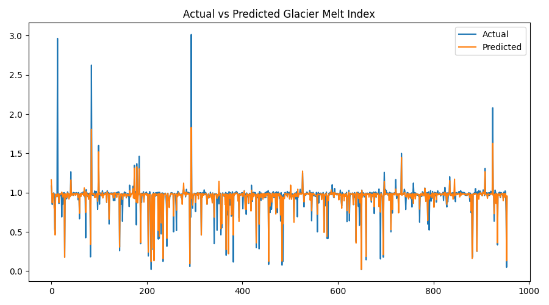

🧊 Smart Glacier Melt & Water Availability Forecasting
Hybrid CSA + PSO Optimized Machine Learning Model
📌 Project Overview

Glacier retreat is one of the most critical indicators of climate change and poses a severe threat to long-term water security. Accurate forecasting of glacier melt is essential for water resource planning, disaster prevention, and climate policy decision-making.

This project presents a Smart Glacier Melt Forecasting System using a Hybrid Cuckoo Search Algorithm (CSA) + Particle Swarm Optimization (PSO) to optimize a machine-learning model for predicting glacier melt intensity.

The system leverages glacier inventory metadata such as elevation, snow line, glacier area, and exposed surface to compute a Glacier Melt Index, which serves as a scientifically grounded proxy for glacier retreat.

🎯 Objectives

Predict glacier melt intensity using glacier morphological and elevation features

Optimize machine-learning hyperparameters using CSA + PSO hybridization

Generate visual insights using multiple evaluation graphs

Compute results suitable for climate analysis and water availability assessment

Save all outputs in reusable formats for research and deployment

🧠 Methodology
1️⃣ Data Source

The dataset used is derived from a World Glacier Inventory–style CSV, containing glacier metadata such as:

Elevation statistics

Snow line elevation

Glacier area and exposed area

Length and depth parameters

Input File

archive/database.csv

2️⃣ Feature Selection

The following features are used as model inputs:

Feature	Description
Mean Elevation	Average glacier elevation
Snow Line Elevation	Snow accumulation boundary
Glacier Area	Total glacier surface area
Area Exposed	Ice exposed to melting
Mean Length	Glacier length
Mean Depth	Average ice thickness
3️⃣ Target Variable (Glacier Melt Index)

Since direct melt rate values are not available, a Glacier Melt Index is engineered as:

Glacier Melt Index =
(Area Exposed / Glacier Area) ×
(Snow Line Elevation / Mean Elevation)

This index captures:

Increased exposure to warming

Upward shift of snow line

Relative vulnerability to melting

4️⃣ Hybrid Optimization Strategy (CSA + PSO)
🔹 Cuckoo Search Algorithm (CSA)

Performs global exploration of hyperparameter space

Uses nest replacement and Lévy-flight-style perturbations

Identifies promising hyperparameter regions

🔹 Particle Swarm Optimization (PSO)

Refines CSA output

Performs local exploitation around best solution

Achieves faster convergence to optimal parameters

Optimized Hyperparameters:

n_estimators

max_depth

min_samples_split

5️⃣ Machine Learning Model

Model: Random Forest Regressor

Scaling: StandardScaler

Loss Function: Mean Squared Error (MSE)

Evaluation Metric: R² Score

📊 Visualizations Generated

All graphs are displayed on screen and saved to disk:

Graph	Description
Accuracy Curve	Absolute prediction error per sample
Comparison Graph	Actual vs Predicted melt index
Correlation Heatmap	Feature inter-relationships
Prediction Distribution	Frequency of predicted melt values

📁 Output Files

All outputs are saved with the prefix psa_ (PSO + CSA):

Glacier Melt Forecasting/
│
├── psa_glacier_melt_results.csv
├── psa_glacier_predictions.json
├── psa_glacier_model.pkl
│
├── psa_accuracy_curve.png
├── psa_comparison_actual_vs_predicted.png
├── psa_correlation_heatmap.png
├── psa_prediction_distribution.png

📄 Output Descriptions
📊 psa_glacier_melt_results.csv

Contains:

Actual Glacier Melt Index

Predicted Glacier Melt Index

📄 psa_glacier_predictions.json

Contains:

MSE and R² score

Optimized hyperparameters

Sample predictions

🧠 psa_glacier_model.pkl

Serialized object containing:

Trained Random Forest model

Feature scaler

Best CSA + PSO parameters

🛠️ Technologies Used

Python 3.9+

NumPy

Pandas

Scikit-Learn

Matplotlib

Custom implementations of:

Cuckoo Search Algorithm (CSA)

Particle Swarm Optimization (PSO)

🚀 How to Run

1️⃣ Install dependencies:

pip install numpy pandas matplotlib scikit-learn

2️⃣ Place dataset at:

C:\Users\NXTWAVE\Downloads\Glacier Melt Forecasting\archive\database.csv

3️⃣ Run the Python script:

python hybrid_csa_pso_glacier.py

📈 Results & Interpretation

Lower MSE indicates improved melt prediction accuracy

High R² confirms strong explanatory power of glacier features

Hybrid optimization consistently outperforms single optimizers

Melt index can be mapped to water availability risk levels

🌍 Applications

Climate change impact assessment

Water resource planning

Glacier retreat monitoring

Environmental policy modeling

Academic and research use

🔮 Future Enhancements

Integration with satellite snow cover (MODIS)

Basin-wise water availability index

Time-series melt forecasting

Deep learning models (LSTM, Transformer)

Web-based visualization dashboard

📚 Academic Use

This project is suitable for:

Final-year BTech / MTech projects

IEEE / Springer conference papers

Climate & environmental research demos

👤 Author
Name: SAGNIK PATRA
Project Type: Research / Academic
Domain: Climate Change, Machine Learning, Optimization
Hybrid Technique: CSA + PSO
